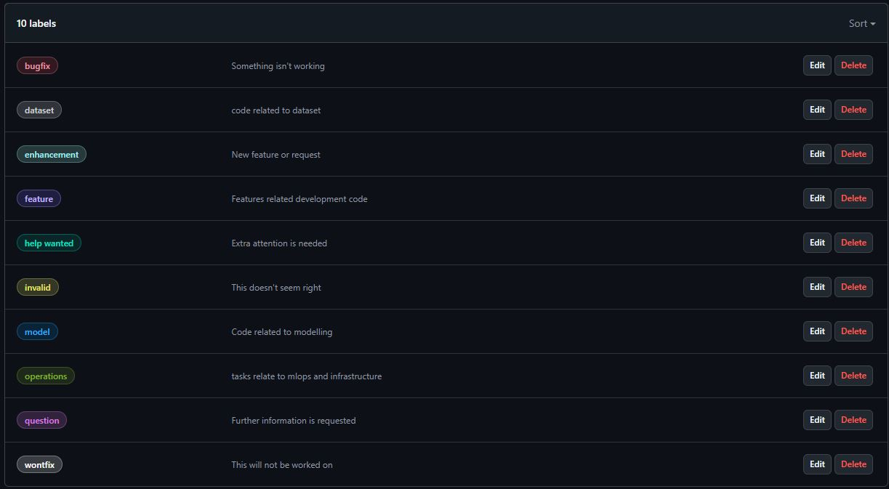

#  Harmonic Densely Connected Network on medical images


##  Environment setup

###  1. Dependencies Installation

####  Python

The first step is to install Python 3.11. Make sure you are installing Python 3.11 (NOT 3.12); hence, we recommend heading to the link below.


Python download link: https://www.python.org/downloads/release/python-3117/


For Mac: macOS 64-bit universal2 installer

For Windows: Windows installer (64-bit)


####  Anaconda

We recommend installing Anaconda Navigator as this comes with VS Code and Jupyter Notebook and more importantly, the ability for you to create and manage virtual environments.


Anaconda Navigator download link: https://www.anaconda.com/download/success


####  Git

Git is a free and open source distributed version control system designed to handle everything from small to very large projects with speed and efficiency


Git download link: https://git-scm.com


###  2. Cloning the repository

You should be able to clone the project repo with

```console

https://github.com/MonashAIM/harmonic-dense-network.git

```

into a designated directory (make sure it is easy to access like a folder in D or C drive)


###  3. Create new conda environment

Open **Anaconda Prompt / Anaconda Powershell Prompt** and naviagate to the folder hosting your local repo.

```console

cd PATH_TO_LOCAL_REPO

```

Run the following command

```console

conda env create -f environment.yaml

```

This steps might take awhile so no need to worry.


##  Development steps

The following are the steps that should be replicate closely to ensure smooth and efficient development tasks

###  1. Create a new branch

As per best practice, always create a new branch first before start working on your task

```console

git checkout -b NEW_BRANCH_NAME

```

> Note: NEW_BRANCH_NAME should make sense and not gibberish


###  2. Format your code

To improve code quality and readibility, it's good to format your code frequently before pushing them. In this project, we will utilize **ruff** since it's a very fast linting software. In order to use **ruff** to format, run the following command:

```console

ruff format

```

In order to use **ruff** to check but **NOT FORMAT**, run the following command:

```console

ruff check

```


###  3. Unit test

In order to better maintance our code, it is required to add some semblance of test case for your new changes. The following are the steps of creating new unit tests

####  3.1 Find the appropriate test file

All unit tests are contained within the folder *tests*

If there has been a test file created the code file you want to test (which will follow the format test_NAME_OF_CODE_FILE.py), you don't need to create a new test file for it. If not, make sure to add a new test file named test_NAME_OF_CODE_FILE.py. For example:

> main.py -> test_main.py


Then, create a test class as followed:

`class TestSample(TestCase):`


####  3.2 Add unit tests

Add a new unit test as a function inside the test class follow this format:

    def test_FUNCTION_TO_TEST(self):

    assert....
Here's an example:

    def test_get_five(self):

    assert get_five() == 5
####  3.3 Add unit tests

To check whether your test runs, use this command:

```console

pytest --cov=. --cov-fail-under=60

```

If no issue arise, you are ***G O O D T O G O***


###  4. Create a Pull Request

After your implementation task is finished, make sure to push all changes and create a new Github Pull Request (PR)

The naming of the PR should follow the format:


> [DOMAIN_TAG]  [WORK_TYPE_TAG] PR_NAME


**DOMAIN_TAG** options: models/dataset/ops

**WORK_TYPE_TAG** options: feature/bugfix


A PR name example:


> [dataset]  [feature] implement a dataloader for ISLES dataset


###  5. Add info for Pull Request


From the pre-establshed list of labels, ensure to add the appropriate labels for your PR




Additionally, it's always a good practice to add another team member to review your PR to minimize errors and bugs


###  6. Check pipeline


There is a pipeline to check for test coverage and ruff lint, if the pipeline fails, please make sure to remedy it with a new push


##  Usefull Git commands

###  Pull new updates

Make sure you are in **main**

```console

git checkout main

```

Fetch new changes

```console

git fetch

```

Pull new changes

```console

git pull

```


###  Create a new branch

```console

git checkout -b NEW_BRANCH_NAME

```


###  Push new changes

```console

git push

```